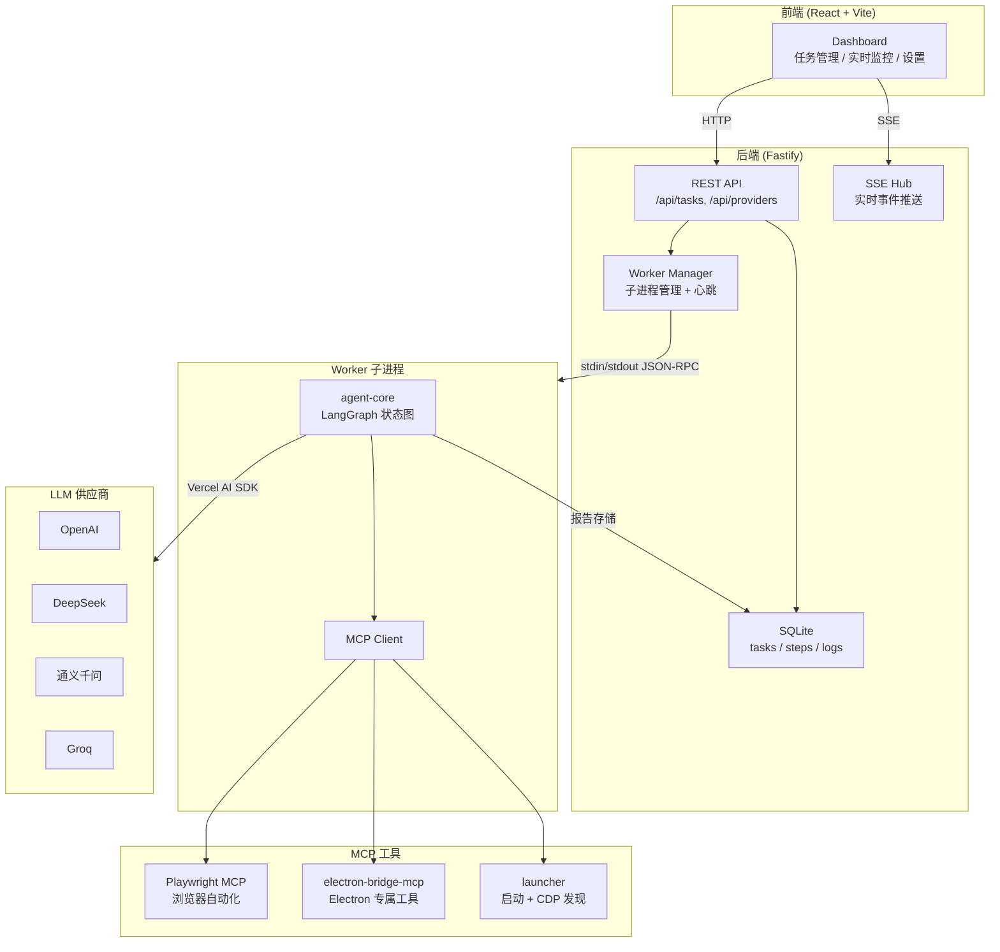
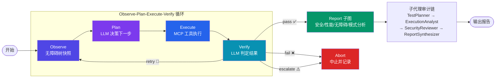

# ElectronHound (EATA)

> **EATA** — Electron App Testing Agent

[](https://github.com/hoye1113/ElectronHound/actions/workflows/ci.yml)
[](LICENSE)
[](https://www.typescriptlang.org/)
[](https://pnpm.io/)
[](https://playwright.dev/)

[English](#english) | [中文](#核心特性)

---

## English

### Overview

ElectronHound is an open-source autonomous AI testing agent that automates testing for Electron applications using natural language goals. Describe what you want to test (e.g., "verify the login form shows an error when password is empty"), and the agent autonomously completes the full **Observe → Plan → Execute → Verify** loop, producing detailed test reports with screenshots, accessibility analysis, and structured feedback.

### Features

- **Natural language driven** — describe test goals in Chinese or English, no scripting required
- **Autonomous closed-loop** — LangGraph-based Observe-Plan-Execute-Verify state graph
- **Accessibility tree aware** — precise UI element targeting via Playwright MCP
- **Screenshot per step** — complete visual test trail
- **Multi-provider LLM** — OpenAI, DeepSeek, Qwen, Groq support
- **Real-time monitoring** — SSE streaming with live step timeline and logs
- **Batch testing** — submit multiple tasks with coordinated execution
- **Export reports** — JSON, CSV, and HTML formats
- **Report customization** — template-based reports with themes and section toggling

### Quick Start

```bash
git clone https://github.com/hoye1113/ElectronHound.git
cd ElectronHound
pnpm install
pnpm dev
```

- **Dashboard**: <http://localhost:5173>
- **Server API**: <http://localhost:3000>

### CLI Mode

```bash
pnpm agent:run --goal "Test the login form" --app /path/to/electron/app --model gpt-4o
```

---

## 中文

**一款开源的自主 AI 测试代理，通过自然语言目标自动测试 Electron 应用。**

EATA 让你只需描述测试目标（如"验证登录表单在密码为空时显示错误提示"），AI 代理便会自主完成 **观察 → 规划 → 执行 → 验证** 的完整闭环，输出包含截图、无障碍分析和结构化反馈的详细测试报告。

---

## 目录

- [核心特性](#核心特性)
- [架构概览](#架构概览)
- [快速开始](#快速开始)
- [LLM 多供应商配置](#llm-多供应商配置)
- [项目结构](#项目结构)
- [开发指南](#开发指南)
- [API 参考](#api-参考)
- [Docker 部署](#docker-部署)
- [配置参考](#配置参考)
- [参与贡献](#参与贡献)
- [License](#license)

---

## 核心特性

### AI 代理能力

- **自然语言驱动** — 用中文或英文描述测试目标，无需编写脚本
- **自主闭环循环** — 基于 LangGraph 的 Observe-Plan-Execute-Verify 状态图
- **无障碍树感知** — 通过 Playwright MCP 获取精确 UI 元素定位
- **每步截图** — 完整的视觉测试轨迹
- **智能终止** — 卡死检测（3 次相同观察自动中止）、最大步数限制、优雅中断
- **断点恢复** — LangGraph SQLite 检查点支持崩溃恢复

### Electron 专属工具

| MCP 工具 | 功能 |
| -------- | ---- |
| `electron_launch` | 启动 Electron 应用并开启 CDP 调试 |
| `electron_close` | 终止指定 Electron 进程 |
| `execute_main` | 在 Electron 主进程执行 JavaScript |
| `trigger_ipc` | 向渲染进程发送 IPC 消息 |
| `mock_dialog` | 模拟原生对话框（打开/保存/消息） |

### 报告与分析

- **报告子图** — 4 个并行分析节点（安全、性能、无障碍、模式检测）汇总生成报告
- **子代理审计链** — TestPlanner → ExecutionAnalyst → SecurityReviewer → ReportSynthesizer
- **反馈学习** — 失败模式自动存储，用于后续 few-shot 提示优化

### Dashboard 前端

- 任务列表 / 创建 / 详情 / 取消 / 删除
- SSE 实时监控 — 步骤时间线、实时日志、无障碍树视图
- 反馈模式浏览与搜索
- LLM 供应商管理（增删改查、连接测试、默认设置）
- 中英文国际化

---

## 架构概览

### 系统架构



### Agent 核心循环



---

## 快速开始

### 环境要求

- **Node.js** >= 18
- **pnpm** >= 9

### 安装与运行

```bash
# 克隆仓库
git clone https://github.com/hoye1113/ElectronHound.git
cd ElectronHound

# 安装依赖
pnpm install

# 启动开发服务（Dashboard + Server 并行）
pnpm dev
```

- **Dashboard**: <http://localhost:5173>
- **Server API**: <http://localhost:3000>

### CLI 模式

```bash
pnpm agent:run --goal "测试登录表单" --app /path/to/electron/app --model gpt-4o
```

---

## LLM 多供应商配置

EATA v0.3 支持多个 OpenAI 兼容的 LLM 供应商，可通过 Dashboard 设置页面或 REST API 管理。

### 内置供应商

| 供应商 | Base URL | 示例模型 |
| ------ | -------- | -------- |
| OpenAI | `https://api.openai.com/v1` | `gpt-4o`, `gpt-4o-mini` |
| DeepSeek | `https://api.deepseek.com/v1` | `deepseek-chat` |
| 通义千问 | `https://dashscope.aliyuncs.com/compatible-mode/v1` | `qwen-plus` |
| Groq | `https://api.groq.com/openai/v1` | `llama-3.1-70b-versatile` |

### 使用方式

1. 打开 Dashboard 设置页: <http://localhost:5173/settings>
2. 点击 **+ 添加供应商**
3. 选择快速模板或手动填写
4. 输入 API Key → 点击 **添加**
5. 可选：点击 ★ 设为默认供应商

### 任务级供应商选择

创建任务时可指定不同的 LLM 供应商，支持：
- 同一测试在不同模型上运行，进行 A/B 对比
- 针对特定任务类型使用专用模型
- 用低成本模型处理简单测试以优化成本

---

## 项目结构

```
ElectronHound/
├── apps/
│   ├── dashboard/              # React 前端 (Vite + Tailwind + Zustand)
│   └── server/                 # Fastify HTTP 服务 + SQLite
├── packages/
│   ├── agent-core/             # LangGraph 测试图 + LLM 集成 + 子代理
│   ├── electron-bridge-mcp/    # Electron 专属 MCP 服务器
│   ├── electron-helper/        # Electron 进程辅助
│   ├── launcher/               # Electron 启动 + CDP 发现
│   └── shared-types/           # Zod schemas + TypeScript 类型
├── fixtures/
│   └── test-electron-app/      # 测试用 Electron 示例应用
├── data/
│   ├── feedback/               # 反馈模式存储
│   ├── few-shot-examples/      # Few-shot 示例
│   └── reports/                # 生成的测试报告
├── tests/
│   ├── e2e/                    # 端到端测试
│   └── integration/            # 集成测试
├── Dockerfile
└── docker-compose.yml
```

### 核心包说明

| 包 | 职责 |
| -- | ---- |
| `agent-core` | LangGraph 状态图编排、LLM 调用、Observe/Plan/Execute/Verify 节点、报告子图、子代理审计链 |
| `electron-bridge-mcp` | MCP 服务器，封装 Electron 专属自动化工具（launch/close/IPC/dialog） |
| `launcher` | Electron 应用启动器，CDP WebSocket 端口自动发现 |
| `electron-helper` | Electron 主进程 IPC 通道与操作处理 |
| `shared-types` | 全项目共享的 Zod schema 和 TypeScript 类型定义 |

---

## 开发指南

### 常用命令

```bash
# 运行全部测试
pnpm test

# 运行特定包的测试
pnpm test -- --project "@eata/agent-core"

# 类型检查
pnpm run --filter "@eata/agent-core" typecheck

# 代码检查
pnpm lint

# 代码格式化
pnpm format
```

### 技术栈

| 层 | 技术 |
| -- | ---- |
| AI 编排 | LangGraph + Vercel AI SDK + OpenAI SDK |
| 自动化 | Playwright (MCP) + CDP |
| 后端 | Fastify 5 + better-sqlite3 + Pino |
| 前端 | React 19 + Vite 8 + Tailwind CSS 4 + Zustand 5 |
| 包管理 | pnpm 9 (monorepo workspace) |
| 测试 | Vitest 3.2 + GitHub Actions CI |
| 容器化 | Docker + docker-compose |

---

## API 参考

### 任务管理

| 方法 | 端点 | 说明 |
| ---- | ---- | ---- |
| `GET` | `/api/tasks` | 获取任务列表 |
| `POST` | `/api/tasks` | 创建任务 |
| `GET` | `/api/tasks/:id` | 获取任务详情（含步骤） |
| `POST` | `/api/tasks/:id/cancel` | 取消运行中的任务 |
| `DELETE` | `/api/tasks/:id` | 删除任务 |

### 报告

| 方法 | 端点 | 说明 |
| ---- | ---- | ---- |
| `GET` | `/api/reports/:id/manifest` | 获取报告清单 |
| `GET` | `/api/reports/:id/timeline` | 获取报告时间线 |

### 供应商管理

| 方法 | 端点 | 说明 |
| ---- | ---- | ---- |
| `GET` | `/api/providers` | 获取供应商列表 |
| `POST` | `/api/providers` | 添加供应商 |
| `PUT` | `/api/providers/:id` | 更新供应商 |
| `DELETE` | `/api/providers/:id` | 删除供应商 |
| `POST` | `/api/providers/:id/test` | 测试供应商连接 |
| `POST` | `/api/providers/:id/activate` | 设为默认供应商 |

### 其他

| 方法 | 端点 | 说明 |
| ---- | ---- | ---- |
| `GET` | `/api/feedback/patterns` | 获取反馈模式 |
| `GET` | `/api/stream/tasks/:id` | SSE 实时任务流 |
| `GET` | `/health` | 健康检查 |

---

## Docker 部署

```bash
# 构建并启动
docker-compose up

# 后台运行
docker-compose up -d
```

服务端口：
- Server: `3000`
- Dashboard: `5173`

---

## 配置参考

### 环境变量（CLI / Worker 模式）

| 变量 | 说明 |
| ---- | ---- |
| `OPENAI_API_KEY` | LLM API Key（兜底配置） |
| `OPENAI_BASE_URL` | LLM Base URL（兜底配置） |
| `LLM_MODEL` | 模型名称（默认: `gpt-4o`） |
| `PROVIDER_ID` | 指定使用某个供应商 ID |

### 服务器配置

| 配置项 | 默认值 |
| ------ | ------ |
| `port` | 3000 |
| `host` | 0.0.0.0 |
| `logLevel` | info |
| `databasePath` | `./data/db.sqlite3` |
| `checkpointPath` | `./data/agent-checkpoints.sqlite3` |
| `dataDir` | `./data` |

### 运行时文件

| 路径 | 用途 |
| ---- | ---- |
| `~/.eata/providers.json` | LLM 供应商配置 |
| `data/db.sqlite3` | 服务端数据库 |
| `data/agent-checkpoints.sqlite3` | LangGraph 检查点 |
| `data/reports/` | 测试报告输出 |
| `data/feedback/patterns.jsonl` | 反馈模式存储 |

---

## 参与贡献

欢迎为 ElectronHound 贡献代码！请遵循以下流程：

### 开发流程

1. **Fork** 本仓库
2. 创建你的特性分支：`git checkout -b feature/amazing-feature`
3. 提交更改：`git commit -m 'feat: add amazing feature'`
4. 推送到远程：`git push origin feature/amazing-feature`
5. 创建 **Pull Request**

### 提交规范

使用 [Conventional Commits](https://www.conventionalcommits.org/) 格式：

- `feat:` — 新功能
- `fix:` — Bug 修复
- `docs:` — 文档更新
- `refactor:` — 代码重构
- `test:` — 测试相关
- `chore:` — 构建/工具链变更

### 开发环境设置

```bash
# 安装依赖
pnpm install

# 运行测试确保一切正常
pnpm test

# 启动开发服务
pnpm dev
```

### 代码规范

- 使用 **TypeScript** 严格模式
- 遵循项目 **ESLint** + **Prettier** 配置
- 新功能需附带对应的 **单元测试**
- 提交前运行 `pnpm test` 和 `pnpm lint` 确保通过

---

## License

[MIT](LICENSE)
