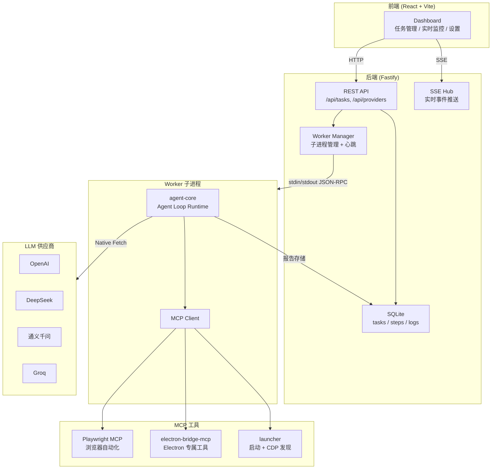
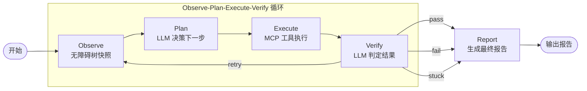
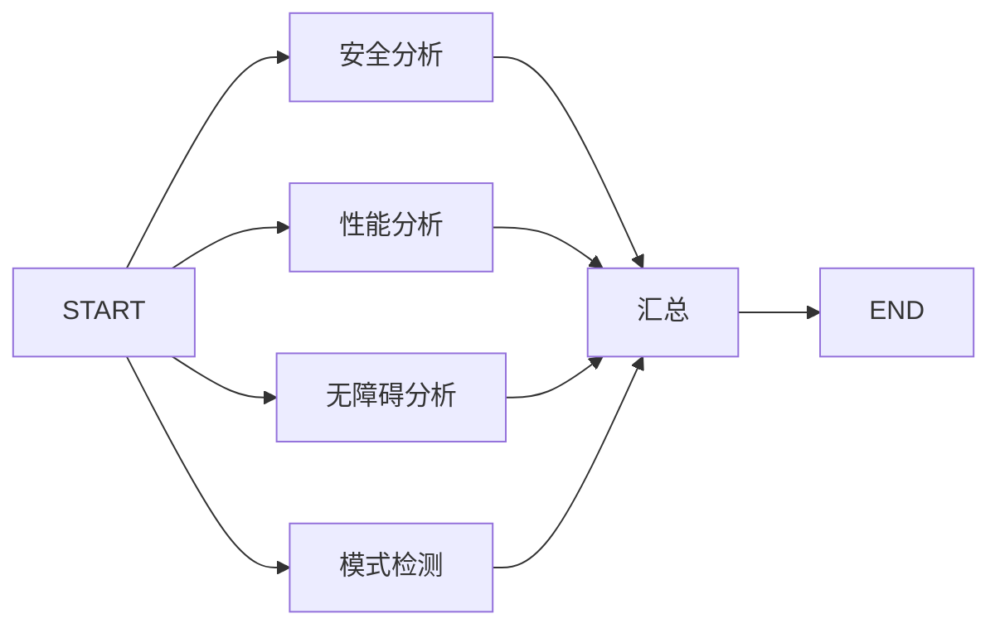
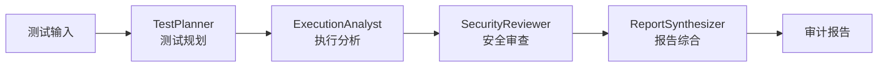

# 架构说明

本文档详细说明 ElectronHound (EATA) 的系统架构、组件关系和数据流。

## 系统架构总览

ElectronHound 采用 **monorepo** 结构，由以下核心层组成：

```
┌─────────────────────────────────────────────────────┐
│                   前端层 (Dashboard)                  │
│            React 19 + Vite 8 + Tailwind 4            │
├─────────────────────────────────────────────────────┤
│                   后端层 (Server)                      │
│            Fastify 5 + SQLite + Pino 日志             │
├─────────────────────────────────────────────────────┤
│                  任务调度层                            │
│           Worker Pool + 任务队列                       │
├─────────────────────────────────────────────────────┤
│               Agent 核心层                            │
│     Pure TypeScript Agent Loop + Native Fetch LLM     │
├─────────────────────────────────────────────────────┤
│                 MCP 工具层                            │
│    Playwright MCP + Electron Bridge MCP              │
├─────────────────────────────────────────────────────┤
│               LLM 供应商层                            │
│    OpenAI / DeepSeek / 通义千问 / Groq               │
└─────────────────────────────────────────────────────┘
```

### 系统架构图



---

## 组件详细说明

### 1. 前端层 (Dashboard)

**技术栈**: React 19 + Vite 8 + Tailwind CSS 4 + Zustand 5

**职责**:
- 任务管理界面（创建、查看、取消、删除）
- 实时 SSE 监控（步骤时间线、日志、无障碍树）
- LLM 供应商管理（增删改查、连接测试）
- 反馈模式浏览
- 中英文国际化

**核心模块**:

| 模块 | 文件 | 说明 |
|------|------|------|
| 状态管理 | `apps/dashboard/src/stores/taskStore.ts` | Zustand 状态管理，任务 CRUD |
| API 客户端 | `apps/dashboard/src/lib/api.ts` | REST API 封装 |
| SSE 客户端 | `apps/dashboard/src/lib/sse.ts` | EventSource 连接管理 |
| 路由 | `apps/dashboard/src/router.tsx` | React Router 路由配置 |

**数据流**:

```
用户操作 → Zustand Store → API 调用 → Server → 数据库
                                    ↓
                              SSE 事件 → Store 更新 → UI 刷新
```

---

### 2. 后端层 (Server)

**技术栈**: Fastify 5 + better-sqlite3 + Pino

**职责**:
- REST API 服务
- SSE 实时事件推送
- Worker 子进程管理
- 数据库操作

**核心模块**:

| 模块 | 文件 | 说明 |
|------|------|------|
| 服务器入口 | `apps/server/src/server.ts` | Fastify 服务器初始化 |
| 任务路由 | `apps/server/src/routes/tasks.ts` | 任务 CRUD API |
| 供应商路由 | `apps/server/src/routes/providers.ts` | 供应商管理 API |
| 报告路由 | `apps/server/src/routes/reports.ts` | 报告获取 API |
| 反馈路由 | `apps/server/src/routes/feedback.ts` | 反馈模式 API |
| SSE Hub | `apps/server/src/streams/sseHub.ts` | SSE 连接管理 |
| Worker Pool | `apps/server/src/services/workerPool/` | 任务队列和执行 |

**数据库 Schema**:

```sql
-- 任务表
CREATE TABLE tasks (
  id TEXT PRIMARY KEY,
  goal TEXT NOT NULL,
  target_app_path TEXT NOT NULL,
  llm_model TEXT,
  status TEXT DEFAULT 'queued',
  max_steps INTEGER DEFAULT 50,
  step_count INTEGER DEFAULT 0,
  context_injection TEXT,
  provider_id TEXT,
  created_at TEXT,
  updated_at TEXT
);

-- 步骤表
CREATE TABLE steps (
  id TEXT PRIMARY KEY,
  task_id TEXT NOT NULL,
  step_index INTEGER NOT NULL,
  phase TEXT NOT NULL,
  status TEXT NOT NULL,
  observation TEXT,
  action TEXT,
  result TEXT,
  reasoning TEXT,
  screenshot_path TEXT,
  accessibility_snapshot_path TEXT,
  timestamp TEXT,
  duration INTEGER,
  FOREIGN KEY (task_id) REFERENCES tasks(id)
);
```

---

### 3. 任务调度层 (Worker Pool)

**职责**:
- 任务队列管理
- 并发控制
- 优先级调度
- 心跳检测

**核心组件**:

| 组件 | 文件 | 说明 |
|------|------|------|
| WorkerPoolManager | `apps/server/src/services/workerPool/manager.ts` | 池管理器 |
| TaskQueue | `apps/server/src/services/workerPool/queue.ts` | 优先级队列 |
| 类型定义 | `apps/server/src/services/workerPool/types.ts` | 接口定义 |

**调度流程**:

```
任务提交 → WorkerPoolManager.submit()
    ↓
检查并发数 < maxConcurrency?
    ├─ 是 → 直接启动任务
    └─ 否 → 加入 TaskQueue (按优先级)
         ↓
    任务完成 → 检查队列 → 取出下一个任务
```

**优先级队列**:

```typescript
type TaskPriority = 'high' | 'medium' | 'low';

// 队列按优先级分桶
buckets: {
  high: PoolTask[],
  medium: PoolTask[],
  low: PoolTask[]
}
```

---

### 4. Agent 核心层

**技术栈**: Pure TypeScript Agent Loop + Native Fetch LLMProvider

**职责**:
- Observe-Plan-Execute-Verify 循环编排
- LLM 调用和结果解析
- 卡死检测和智能终止
- 会话持久化
- 报告生成

**核心模块**:

| 模块 | 文件 | 说明 |
|------|------|------|
| Agent Loop | `packages/agent-core/src/runtime/agentLoop.ts` | 核心 while 循环编排 |
| 卡死检测 | `packages/agent-core/src/runtime/stuckDetection.ts` | 指纹窗口检测 |
| 运行时类型 | `packages/agent-core/src/runtime/types.ts` | AgentLoopConfig, Observation, Plan 等 |
| LLM Provider | `packages/agent-core/src/llm/openai-provider.ts` | Native Fetch OpenAI 兼容 |
| LLM 适配器 | `packages/agent-core/src/llm/adapter.ts` | 向后兼容桥接 |
| 会话管理 | `packages/agent-core/src/session/sessionManager.ts` | SQLite 会话持久化 |
| MCP 客户端 | `packages/agent-core/src/mcp/client.ts` | MCP 工具调用 |
| 配置管理 | `packages/agent-core/src/config-manager.ts` | 供应商配置管理 |

**Agent 核心循环**:



**状态定义** (纯 TypeScript，无 Annotation/Reducer):

```typescript
interface AgentLoopState {
  sessionId: string;           // 会话 ID
  taskPrompt: string;          // 测试目标
  stepCount: number;           // 当前步数
  currentObservation: Observation | null;
  lastPlan: Plan | null;
  lastExecution: ExecutionResult | null;
  stuckCount: number;          // 卡死计数器
}
```

**路由逻辑** (if/else，无条件边图):

```typescript
while (state.stepCount < maxSteps) {
  const observation = await this.observe(state);

  // 卡死检测：N 次相同指纹 → abort
  if (stuckDetector.isStuck()) return { verdict: 'stuck', report };

  const plan = await this.plan(observation);
  const execution = await this.execute(plan);
  const verdict = await this.verify(execution, plan);

  if (verdict === 'pass' || verdict === 'fail' || verdict === 'stuck') {
    return { verdict, report: await this.report(state, verdict) };
  }
  // verdict === 'retry': continue loop
}
```

---

### 5. 报告子图 (Report Sub-Graph)

**职责**:
- 并行执行 4 个分析节点
- 汇总生成最终报告

**架构**:



**分析节点**:

| 节点 | 文件 | 说明 |
|------|------|------|
| 安全分析 | `packages/agent-core/src/report-graph/nodes/safety.ts` | 检测安全风险 |
| 性能分析 | `packages/agent-core/src/report-graph/nodes/performance.ts` | 分析执行性能 |
| 无障碍分析 | `packages/agent-core/src/report-graph/nodes/accessibility.ts` | WCAG 合规检查 |
| 模式检测 | `packages/agent-core/src/report-graph/nodes/pattern.ts` | 检测测试模式 |
| 汇总 | `packages/agent-core/src/report-graph/nodes/summarize.ts` | 生成最终报告 |

---

### 6. 子代理审计链 (Sub-Agent Audit Chain)

**职责**:
- 4 个角色顺序执行
- 每个角色接收上游输出作为上下文
- 生成综合审计报告

**流程**:



**子代理角色**:

| 角色 | 文件 | 职责 |
|------|------|------|
| TestPlanner | `packages/agent-core/src/sub-agents/test-planner.ts` | 分析测试计划的合理性 |
| ExecutionAnalyst | `packages/agent-core/src/sub-agents/execution-analyst.ts` | 分析执行过程和结果 |
| SecurityReviewer | `packages/agent-core/src/sub-agents/security-reviewer.ts` | 安全风险审查 |
| ReportSynthesizer | `packages/agent-core/src/sub-agents/report-synthesizer.ts` | 综合生成最终报告 |

**审计链特点**:

- **顺序执行**: 保证下游能获取上游输出
- **容错处理**: 单个子代理失败不影响其他子代理
- **上下文传递**: 每个子代理接收所有上游输出

---

### 7. MCP 工具层

**职责**:
- 提供浏览器自动化能力
- 提供 Electron 专属操作

**组件**:

| 组件 | 包 | 说明 |
|------|-----|------|
| Playwright MCP | `@playwright/mcp` | 浏览器自动化 |
| Electron Bridge MCP | `@eata/electron-bridge-mcp` | Electron 专属工具 |
| Launcher | `@eata/launcher` | Electron 启动和 CDP 发现 |

**Electron Bridge MCP 工具**:

| 工具 | 函数 | 说明 |
|------|------|------|
| `electron_launch` | `electronLaunch()` | 启动 Electron 应用 |
| `electron_close` | `electronClose()` | 关闭 Electron 进程 |
| `execute_main` | `executeMain()` | 在主进程执行代码 |
| `trigger_ipc` | `triggerIpc()` | 发送 IPC 消息 |
| `mock_dialog` | `mockDialog()` | 模拟原生对话框 |

**MCP 通信协议**:

```
Agent Core
    ↓ (MCP 协议)
MCP Client
    ↓ (stdio)
MCP Server (Playwright / Electron Bridge)
    ↓
目标应用
```

**Bridge Client 通信**:

```typescript
// NDJSON 协议 (换行分隔的 JSON)
interface BridgeMessage {
  type: string;      // 消息类型
  id?: string;       // 请求 ID (用于匹配响应)
  payload?: unknown; // 消息体
}
```

---

### 8. LLM 供应商层

**职责**:
- 提供 LLM 接口
- 支持多供应商切换
- API Key 加密存储

**供应商配置**:

```typescript
interface LLMProviderConfig {
  id: string;        // 供应商 ID
  name: string;      // 显示名称
  type: 'openai-compatible';  // 类型
  apiKey: string;    // API Key (加密存储)
  baseURL: string;   // API 基础 URL
  model: string;     // 默认模型
  enabled?: boolean; // 是否启用
}
```

**配置存储**:

- 位置: `~/.eata/providers.json`
- 加密: AES-256-CBC 加密 API Key
- 默认供应商: OpenAI, DeepSeek, 通义千问

**供应商工厂**:

```typescript
// 创建供应商实例
function createProviderInstance(config: LLMProviderConfig) {
  const openai = createOpenAI({
    apiKey: config.apiKey,
    baseURL: config.baseURL,
  });
  return openai(config.model);
}
```

---

## 数据流

### 1. 任务创建流程

```
用户创建任务
    ↓
Dashboard → POST /api/tasks
    ↓
Server 验证请求
    ↓
写入 SQLite (status: 'queued')
    ↓
提交到 WorkerPoolManager
    ↓
WorkerPoolManager 检查并发数
    ├─ 有空闲 → 启动 Worker 子进程
    └─ 无空闲 → 加入 TaskQueue
    ↓
Worker 子进程启动
    ↓
初始化 MCP Client
    ↓
启动 Agent Loop
```

### 2. Agent 执行流程

```
START → Observe
    ↓
MCP Client 调用 playwright.browser_snapshot
    ↓
获取无障碍树快照
    ↓
计算观察哈希，检测卡死
    ↓
Plan (LLM)
    ↓
构建提示词（目标 + 观察 + 历史 + 反馈模式 + Few-shot）
    ↓
调用 LLM 生成执行计划
    ↓
Execute
    ↓
MCP Client 调用对应工具
    ↓
执行操作并截图
    ↓
Verify (LLM)
    ↓
构建提示词（目标 + 预期 + 实际结果）
    ↓
调用 LLM 判定结果
    ↓
路由决策
    ├─ pass → Report
    ├─ retry → Observe (循环)
    ├─ fail → Report
    └─ escalate → Abort
```

### 3. 报告生成流程

```
Report 节点触发
    ↓
创建报告子图
    ↓
并行执行 4 个分析节点
    ├─ 安全分析
    ├─ 性能分析
    ├─ 无障碍分析
    └─ 模式检测
    ↓
汇总节点合并结果
    ↓
返回分析报告
```

### 4. 子代理审计流程

```
报告子图完成
    ↓
启动子代理审计链
    ↓
TestPlanner 分析
    ↓ (输出传递给下游)
ExecutionAnalyst 分析
    ↓ (输出传递给下游)
SecurityReviewer 分析
    ↓ (输出传递给下游)
ReportSynthesizer 综合
    ↓
生成最终审计报告
```

### 5. SSE 实时推送流程

```
Worker 执行步骤
    ↓
SSE Hub 广播事件
    ↓
Dashboard EventSource 接收
    ↓
Zustand Store 更新
    ↓
React 组件重新渲染
```

---

## 关键设计决策

### 1. 为什么使用纯 TypeScript Agent Loop?

- **轻量**: 移除 LangGraph / Vercel AI SDK 依赖，减少 bundle 大小和启动时间
- **可控**: 纯 while 循环 + if/else 路由，逻辑完全透明
- **可测试**: 纯函数和接口，易于单元测试
- **会话持久化**: SQLite 会话管理替代 LangGraph checkpoint

### 2. 为什么使用 MCP?

- **标准化**: MCP 是 AI 工具调用的标准协议
- **解耦**: 工具实现与 Agent 逻辑分离
- **可扩展**: 易于添加新的 MCP 工具
- **复用**: Playwright MCP 提供成熟的浏览器自动化能力

### 3. 为什么使用 monorepo?

- **代码共享**: `shared-types` 包提供统一的类型定义
- **原子提交**: 跨包修改可以在一个提交中完成
- **统一工具链**: 共享 ESLint、Prettier、TypeScript 配置
- **简化依赖管理**: pnpm workspace 自动链接本地包

### 4. 为什么使用 Worker 子进程?

- **隔离性**: 单个任务崩溃不影响其他任务
- **资源控制**: 可限制并发数，避免资源耗尽
- **可监控**: 子进程通过 JSON-RPC 通信，便于监控

### 5. 为什么使用 SSE 而不是 WebSocket?

- **简单性**: SSE 是单向的，实现更简单
- **HTTP 兼容**: SSE 基于 HTTP，更容易穿透代理和防火墙
- **自动重连**: EventSource 内置自动重连机制
- **足够用**: 任务监控只需要服务器到客户端的单向推送

---

## 包依赖关系

```
shared-types
    ↑
agent-core ← electron-bridge-mcp
    ↑              ↑
    |              launcher
    |
    +---- apps/server
    |
    +---- apps/dashboard
```

### 包说明

| 包 | 职责 | 依赖 |
|----|------|------|
| `shared-types` | Zod schemas + TypeScript 类型 | 无 |
| `agent-core` | Agent Loop Runtime、LLM Provider、会话管理、子代理 | shared-types |
| `electron-bridge-mcp` | Electron 专属 MCP 服务器 | launcher |
| `launcher` | Electron 启动 + CDP 发现 | 无 |
| `electron-helper` | Electron 主进程 IPC 通道 | 无 |
| `apps/server` | Fastify HTTP 服务 + SQLite | agent-core, shared-types |
| `apps/dashboard` | React 前端 | shared-types |

---

## 安全架构

### 1. API 认证

```typescript
// 可选的 API Key 认证
EATA_API_KEY=your_secure_api_key

// 请求头
x-api-key: your_secure_api_key
```

### 2. API Key 加密存储

```typescript
// AES-256-CBC 加密
const ENCRYPTION_ALGO = 'aes-256-cbc';
const ENCRYPTION_KEY = scryptSync('eata-provider-key', 'eata-salt', 32);

// 存储格式: enc:<iv>:<encrypted>
function encryptApiKey(plain: string): string {
  const iv = randomBytes(16);
  const cipher = createCipheriv(ENCRYPTION_ALGO, ENCRYPTION_KEY, iv);
  const encrypted = Buffer.concat([cipher.update(plain, 'utf8'), cipher.final()]);
  return `enc:${iv.toString('hex')}:${encrypted.toString('hex')}`;
}
```

### 3. 路径验证

```typescript
// 防止路径遍历攻击
function validatePath(baseDir: string, userPath: string): string {
  const resolved = resolve(baseDir, userPath);
  if (!resolved.startsWith(resolve(baseDir))) {
    throw new Error('Path traversal detected');
  }
  return resolved;
}
```

---

## 性能优化

### 1. 数据库优化

```javascript
// 启用 WAL 模式
db.pragma('journal_mode = WAL');
db.pragma('synchronous = NORMAL');
db.pragma('cache_size = -2000'); // 2MB cache
```

### 2. Worker 池优化

```json
{
  "worker": {
    "maxWorkers": 3,  // CPU 核心数 - 1
    "queueSize": 100,
    "priorityLevels": 3
  }
}
```

### 3. 卡死检测

```typescript
// 3 次相同观察自动中止
if (state.stuckCounter >= 3) {
  return 'stuck';  // 触发 Abort
}

// 观察哈希比较
const currentHash = hashString(ariaTreeStr);
const stuck = currentHash === state.lastObservationHash;
const stuckCounter = stuck ? state.stuckCounter + 1 : 0;
```

---

## 下一步

- [用户手册](../user-guide/README.md) - 了解如何使用 ElectronHound
- [API 文档](../api/README.md) - 查看完整 API 文档
- [故障排除](../troubleshooting/README.md) - 遇到问题时的解决方案
